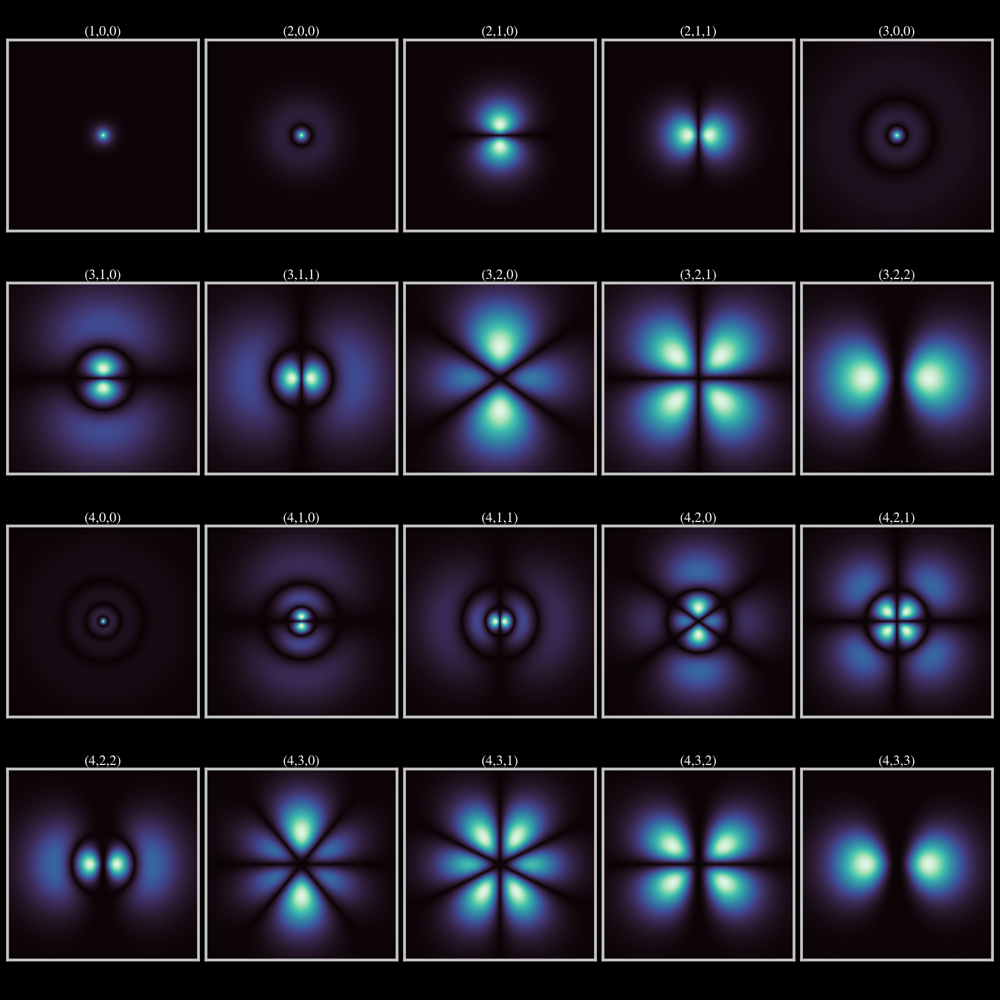

# Quantum Visualization of the Hydrogen Atom

In this Jupyter notebook, fundamental aspects of the hydrogen atom are explored, specifically its wavefunction and the electron orbits associated with different quantum states. Using libraries such as **Matplotlib**, **Seaborn**, and **SciPy**, calculations and visualizations are performed to graphically represent both the probabilities of finding an electron in a specific region of space and the trajectories of its orbit at different energy levels.

---

The wavefunction equation of the hydrogen atom is:

$$
\psi_{n,l,m}(r, \theta, \varphi) = \sqrt{\left( \frac{2}{n b_r} \right)^3 \frac{(n - l - 1)!}{2n[(n + l)!]}} e^{-r/nb_r} \left( \frac{2r}{n b_r} \right)^l L_{n-l-1}^{2l+1} · Y_l^m (\theta, \varphi)
$$

where:

$$
\begin{aligned}
&{n, l, m} \quad \text{are the quantum numbers,} \\
& r, \ \theta, \ \varphi \quad \text{are the spherical coordinates,} \\
& b_r \quad \text{is the Bohr radius,} \\
& L_{n-l-1}^{2l+1} \quad \text{​is a Laguerre polynomial,} \\
& Y_l^m (\theta, \varphi) \quad \text{is a spherical harmonic function.}
\end{aligned}
$$

---

  

---

 

For more information, visit:
- [Wavefunction of the hydrogen atom](https://en.wikipedia.org/wiki/Hydrogen_atom#Wavefunction)
- [Visualization of the hydrogen atom's electron orbitals](https://en.wikipedia.org/wiki/Hydrogen_atom#Visualizing_the_hydrogen_electron_orbitals)